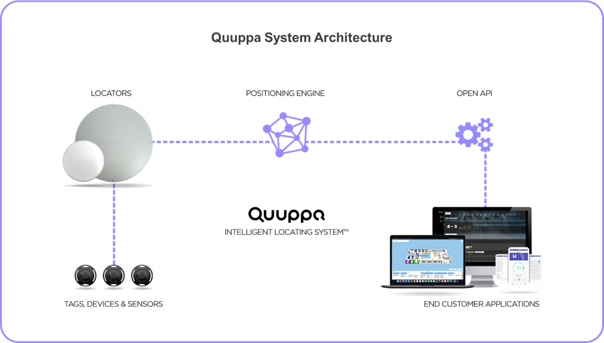

# Quuppa Labs

## About Quuppa
The Quuppa Intelligent Locating System™ is a powerful one-size-fits-all technology platform used for a variety of location-based services and applications. The system enables businesses across industries to achieve more by providing reliable, accurate and real-time location data for people and objects. It's made up of both software and hardware components, including the Quuppa Positioning Engine, other software applications, Locators and tags.

A key component of the Quuppa system is our open APIs that allow developers to easily integrate the data provided by the Quuppa system into their end user applications. The possible use cases are endless, from manufacturing & logistics to healthcare, smart buildings, retail and even sports. Anything you can think of that could benefit from better location data. 

Want to learn more? Check out the examples and open source projects shared here on Github for our community of developers. 

## Resources
* **Company & Products:** [quuppa.com](https://www.quuppa.com/)
* **Documentation:** [quuppa.com/documentation](https://quuppa.com/product-documentation/manuals/q/)

